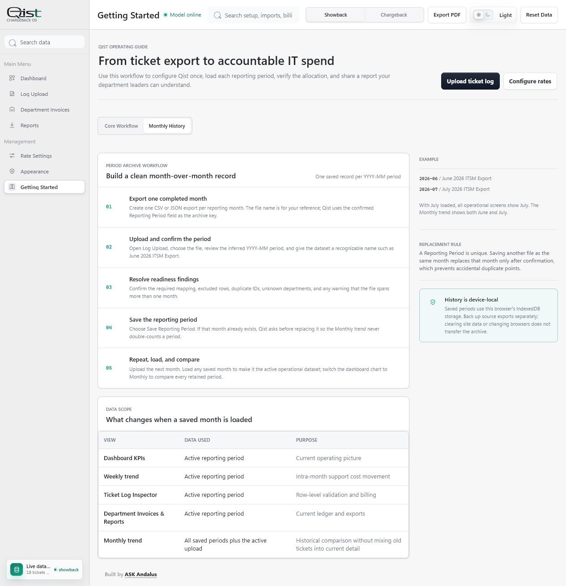

# Qist

Qist is a client-side IT chargeback and showback dashboard for ITSM cost modeling. It helps IT leadership turn monthly ticket exports into department-level billing, SLA impact analysis, asset density, and executive-ready reports.

The name **Qist** was chosen to signal fairness and measured allocation: each department sees its proportional share, the assumptions behind that share, and the difference between informational showback and actual chargeback.


## Highlights

- Client-side only: no backend, database, account, or telemetry.
- Realistic mock ITSM data loads on launch so the dashboard is immediately usable.
- CSV and JSON uploader with smart field mapping for common ticket export columns.
- Import Readiness validation for missing mappings, invalid rows, duplicate ticket IDs, and departments without configured allocation data.
- Configurable departments, headcount, hourly rates, flat fees, SLA multipliers, after-hours rules, asset rates, license rates, PHI/compliance surcharges, e-waste charges, and shared overhead.
- Showback/chargeback mode switch for informational reporting or ledger-style recovery views.
- Executive dashboard with aligned recovery metrics, weekly/monthly cost trends, department mix, highest-spend departments, and recent ticket activity.
- Ticket inspector with filters for department, priority, sensitivity, and free-text search.
- Period-aware Monthly History for saving one named ticket dataset per `YYYY-MM` reporting period, with load, replace, and delete controls.
- Appearance settings for organization details and logo branding.
- Built-in Getting Started guide with a dedicated Monthly History subtab, plain-language workflow, billing definitions, and local-data guidance.
- Branded print-ready executive PDF report plus invoice-ready CSV exports.

## Screenshots

| Dashboard | Dark Mode |
| --- | --- |
|  |  |

| Ticket Inspector | Appearance Settings |
| --- | --- |
|  |  |

| Getting Started Guide |
| --- |
|  |

| Executive Report Preview |
| --- |
|  |

## Quick Start

No build step is required.

1. Clone or download the repository.
2. Open `index.html` in a modern browser.
3. Use the preloaded mock dataset, or upload your own CSV/JSON export from the **Log Upload** view.

For a local static server:

```bash
python -m http.server 4173
```

Then open:

```text
http://127.0.0.1:4173/index.html
```

## How To Use

1. Start on **Dashboard** to review total modeled recovery, top departments, spend trends, SLA exposure, and recent ticket activity. **Weekly** uses the active dataset; **Monthly** compares all saved reporting periods.
2. Go to **Log Upload** to drag in a CSV or JSON ticket export. Qist detects common column names and lets you inspect the mapping and Import Readiness result before analysis.
3. Confirm the inferred **Reporting Period** and edit the **Dataset Name** if needed. Choose **Save Reporting Period** in Monthly History to retain it on this device. Saving the same month again asks before replacing it, so a period is never double-counted.
4. Use **Rate Settings** to tune labor rates, flat fees, SLA multipliers, asset/license subscriptions, compliance surcharges, and overhead allocation.
5. Open **Appearance** to add the end user's organization name, division, address, prepared-by details, contact information, and logo.
6. Open **Getting Started** for the setup workflow and plain-language billing reference. Its **Monthly History** subtab explains the recurring upload process and which views use current versus historical data.
7. Use **Department Invoices** for department-level ledger views and cost-center detail.
8. Use **Reports** or **Export PDF** to generate a branded executive report, ledger CSV, or calculated ticket CSV.

## Supported Upload Fields

Qist accepts CSV or JSON arrays. Column names are normalized, so common variations are supported.

| Field | Description |
| --- | --- |
| `ticketId` | Ticket, incident, request, or case identifier |
| `createdDate` | Ticket creation date |
| `closedDate` | Ticket closure date |
| `department` | Department, cost center owner, or business unit |
| `priority` | Low, Medium, High, Critical, or similar urgency |
| `sensitivity` | General IT, Clinical Systems, EMR/PACS, Security Incident, PHI, etc. |
| `assets` | Asset IDs associated with the ticket |
| `deviceTypes` | Workstation, Clinical Cart, Mobile / Telemetry, SaaS Seat, etc. |
| `hours` | Decimal hours, `HH:MM`, `1h 30m`, or numeric minutes/seconds when identified by the column header |
| `slaStatus` | Met, Breached, or another recognizable pass/fail status; blanks remain Unknown |
| `tier` | Resolution tier or skill level required |
| `projectCode` | Optional project/capital code |
| `afterHours` | Optional after-hours/on-call flag |

Sample files are included in [`sample-data/tickets.csv`](sample-data/tickets.csv) and [`sample-data/tickets.json`](sample-data/tickets.json).

For the complete import contract, accepted formats, validation behavior, reporting-period guidance, and a worked billing example, see [`docs/DATA_SCHEMA.md`](docs/DATA_SCHEMA.md).

Maintainers can use [`docs/VERIFICATION.md`](docs/VERIFICATION.md) for the parser, calculation, settings, persistence, analytics, and export regression checklist.

## Calculation Model

Qist models departmental spend as:

```text
Department spend =
  asset subscription base
  + ticket support cost
  + shared overhead allocation
  + sensitivity/compliance surcharges
  + after-hours mobilization charges
  + SLA breach credits
```

Ticket support cost can use flat tier fees or hourly calculation:

```text
ticket cost = hours x skill rate x priority/SLA multiplier
```

Shared overhead is allocated by department headcount, making enterprise infrastructure cost visible without hiding assumptions.

Use one reporting period per finance-ready import. Period-level asset subscriptions and shared overhead are allocated once to the active dataset, while weekly/monthly charts show actual gross and net ticket support cost for the dates in the file.

## Reporting Periods And Monthly History

Qist does not depend on a special file name. After parsing the file, it infers a `YYYY-MM` Reporting Period from the most common valid Created Date and asks the user to confirm it. The confirmed period is the unique archive key.

1. Export one completed month from the ITSM platform.
2. Upload it, confirm column mapping and Import Readiness, then confirm the Reporting Period.
3. Save the period. A second save for the same `YYYY-MM` replaces that month only after confirmation.
4. Upload and save the next month.
5. Load any saved month to make it active for KPIs, ticket detail, department invoices, reports, and the Weekly trend.
6. Switch the dashboard chart to Monthly to compare all saved periods. Historical points are recalculated with the currently configured rates so the series remains comparable.

Saved periods live in IndexedDB for the current browser and device. They are not synced to another computer, included in the GitHub repository, or recoverable after browser site data is cleared. Keep the original monthly exports as the system-of-record backup.

## Exporting

- **Executive PDF** opens a polished print-ready report. Use the browser print dialog to save it as PDF.
- **Ledger CSV** exports department-level totals for invoice or finance workflows.
- **Ticket CSV** exports row-level calculated billing amounts for audit and reconciliation.

Organization details and logos configured in **Appearance** appear in the executive report header alongside the Qist logo.

## Privacy

Qist runs entirely in the browser. Uploaded files are parsed locally and are not sent to a server.

Settings, appearance, and theme preferences are saved in browser storage. Ticket uploads are not silently retained; use **Save Reporting Period** to explicitly store a monthly import in local IndexedDB. Saved periods stay on that device/browser and can be loaded or deleted from **Monthly History**.

## GitHub Pages

This is a static web app. To publish it with GitHub Pages:

1. Push the repository to GitHub.
2. Open the repository **Settings** tab.
3. Go to **Pages**.
4. Select the branch containing `index.html`.
5. Save the Pages configuration.

## Project Structure

```text
.
+-- assets/
|   `-- qistlogo-mask.svg
+-- docs/
|   +-- DATA_SCHEMA.md
|   +-- VERIFICATION.md
|   +-- WRITEUP.md
|   `-- screenshots/
+-- sample-data/
|   +-- tickets.csv
|   `-- tickets.json
+-- index.html
`-- README.md
```

## Built By

Built by [ASK Andalus](https://github.com/ahmadsk-cell/).
You can find me on LinkedIn [Ahmad Sheikh-Khalil](https://www.linkedin.com/in/ahmad-sheikh-khalil-161402149/).

## License

This project is licensed under the [MIT License](LICENSE).
