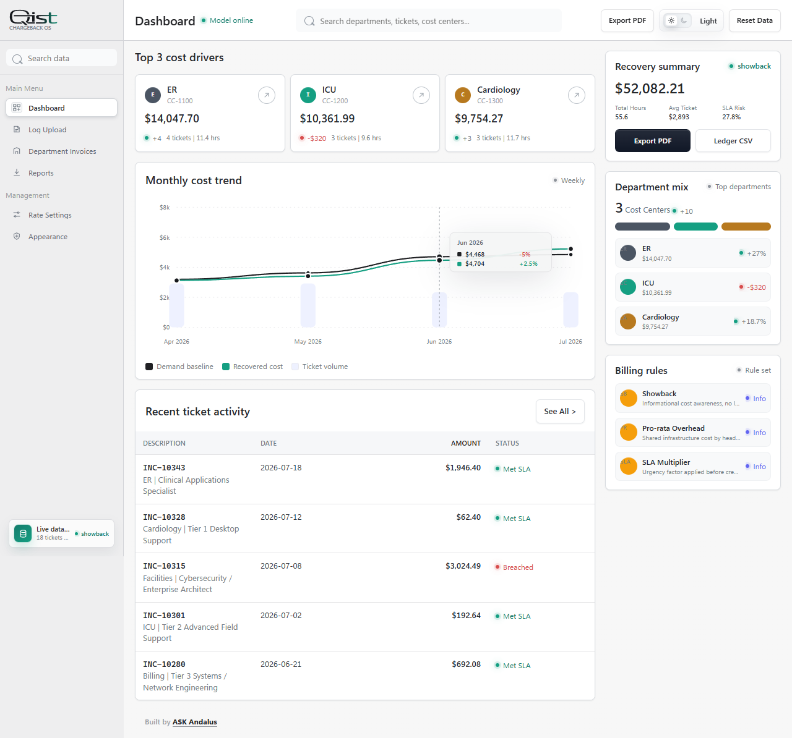
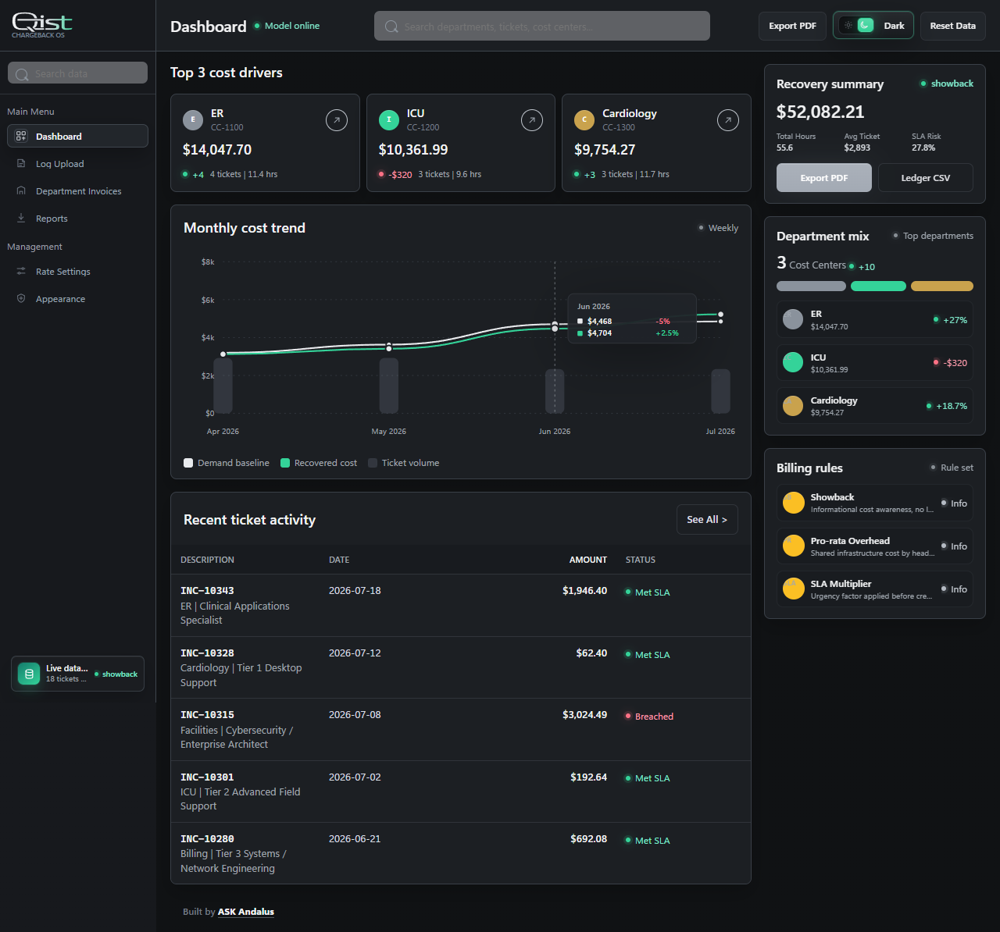
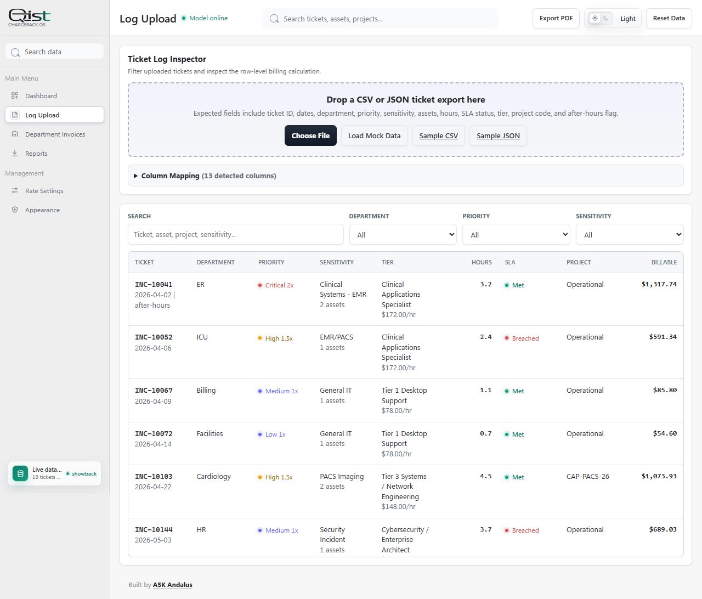
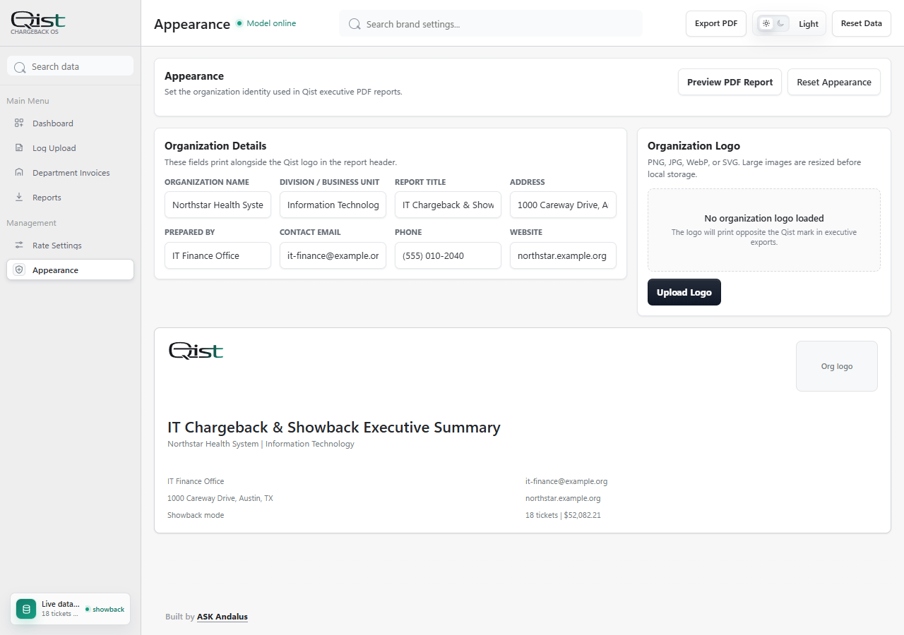
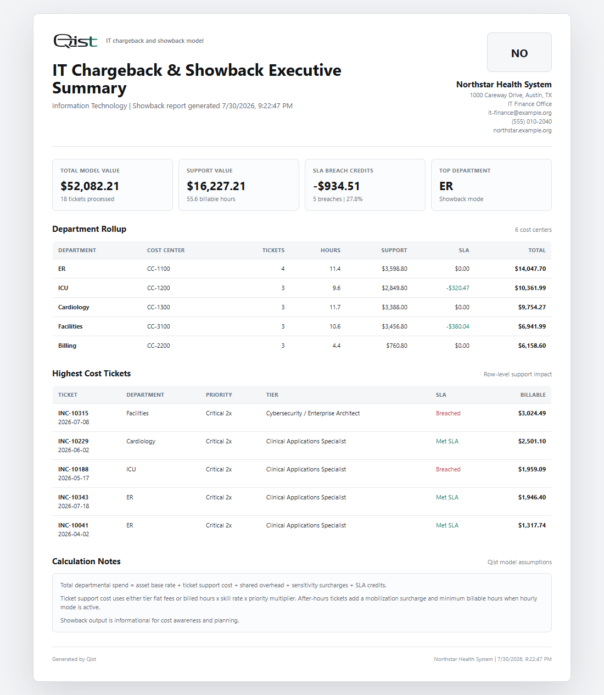

# Qist

Qist is a client-side IT chargeback and showback dashboard for ITSM cost modeling. It helps IT leadership turn monthly ticket exports into department-level billing, SLA impact analysis, asset density, and executive-ready reports.

The name **Qist** was chosen to signal fairness and measured allocation: each department sees its proportional share, the assumptions behind that share, and the difference between informational showback and actual chargeback.



## Highlights

- Client-side only: no backend, database, account, or telemetry.
- Realistic mock ITSM data loads on launch so the dashboard is immediately usable.
- CSV and JSON uploader with smart field mapping for common ticket export columns.
- Configurable departments, headcount, hourly rates, flat fees, SLA multipliers, after-hours rules, asset rates, license rates, PHI/compliance surcharges, e-waste charges, and shared overhead.
- Showback/chargeback mode switch for informational reporting or ledger-style recovery views.
- Executive dashboard with KPI cards, monthly cost trend, department mix, top cost drivers, and recent ticket activity.
- Ticket inspector with filters for department, priority, sensitivity, and free-text search.
- Appearance settings for organization details and logo branding.
- Branded print-ready executive PDF report plus invoice-ready CSV exports.

## Screenshots

| Dashboard | Dark Mode |
| --- | --- |
|  |  |

| Ticket Inspector | Appearance Settings |
| --- | --- |
|  |  |

| Executive Report Preview |
| --- |
|  |

## Quick Start

No build step is required.

1. Clone or download the repository.
2. Open `index.html` in a modern browser.
3. Use the preloaded mock dataset, or upload your own CSV/JSON export from the **Log Upload** view.

For a local static server:

```bash
python -m http.server 4173
```

Then open:

```text
http://127.0.0.1:4173/index.html
```

## How To Use

1. Start on **Dashboard** to review total modeled recovery, top departments, spend trends, SLA exposure, and recent ticket activity.
2. Go to **Log Upload** to drag in a CSV or JSON ticket export. Qist detects common column names and lets you inspect the mapping before analysis.
3. Use **Rate Settings** to tune labor rates, flat fees, SLA multipliers, asset/license subscriptions, compliance surcharges, and overhead allocation.
4. Open **Appearance** to add the end user's organization name, division, address, prepared-by details, contact information, and logo.
5. Use **Department Invoices** for department-level ledger views and cost-center detail.
6. Use **Reports** or **Export PDF** to generate a branded executive report, ledger CSV, or calculated ticket CSV.

## Supported Upload Fields

Qist accepts CSV or JSON arrays. Column names are normalized, so common variations are supported.

| Field | Description |
| --- | --- |
| `ticketId` | Ticket, incident, request, or case identifier |
| `createdDate` | Ticket creation date |
| `closedDate` | Ticket closure date |
| `department` | Department, cost center owner, or business unit |
| `priority` | Low, Medium, High, Critical, or similar urgency |
| `sensitivity` | General IT, Clinical Systems, EMR/PACS, Security Incident, PHI, etc. |
| `assets` | Asset IDs associated with the ticket |
| `deviceTypes` | Workstation, Clinical Cart, Mobile / Telemetry, SaaS Seat, etc. |
| `hours` | Time spent on the ticket |
| `slaStatus` | Met or Breached |
| `tier` | Resolution tier or skill level required |
| `projectCode` | Optional project/capital code |
| `afterHours` | Optional after-hours/on-call flag |

Sample files are included in [`sample-data/tickets.csv`](sample-data/tickets.csv) and [`sample-data/tickets.json`](sample-data/tickets.json).

## Calculation Model

Qist models departmental spend as:

```text
Department spend =
  asset subscription base
  + ticket support cost
  + shared overhead allocation
  + sensitivity/compliance surcharges
  + after-hours mobilization charges
  + SLA credits or penalties
```

Ticket support cost can use flat tier fees or hourly calculation:

```text
ticket cost = hours x skill rate x priority/SLA multiplier
```

Shared overhead is allocated by department headcount, making enterprise infrastructure cost visible without hiding assumptions.

## Exporting

- **Executive PDF** opens a polished print-ready report. Use the browser print dialog to save it as PDF.
- **Ledger CSV** exports department-level totals for invoice or finance workflows.
- **Ticket CSV** exports row-level calculated billing amounts for audit and reconciliation.

Organization details and logos configured in **Appearance** appear in the executive report header alongside the Qist logo.

## Privacy

Qist runs entirely in the browser. Uploaded files are parsed locally, stored only in the current browser session/local storage, and are not sent to a server.

## GitHub Pages

This is a static web app. To publish it with GitHub Pages:

1. Push the repository to GitHub.
2. Open the repository **Settings** tab.
3. Go to **Pages**.
4. Select the branch containing `index.html`.
5. Save the Pages configuration.

## Project Structure

```text
.
+-- assets/
|   `-- qistlogo-mask.svg
+-- docs/
|   +-- WRITEUP.md
|   `-- screenshots/
+-- sample-data/
|   +-- tickets.csv
|   `-- tickets.json
+-- index.html
`-- README.md
```

## Built By

Built by [ASK Andalus](https://github.com/ahmadsk-cell/).
